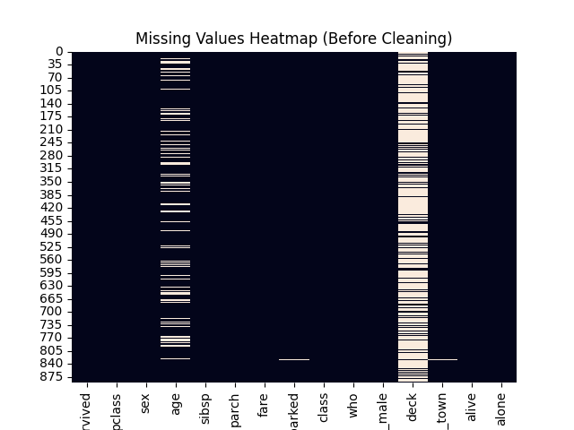
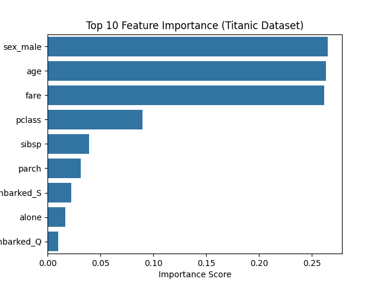

# A Beginner's Guide to Understand Missing Values in Data (Titanic-Feature-Importance)

## Introduction

When we start working with data in Machine Learning, the first and most important step is **understanding the data**. Before building any model, we must check:

  *Is our data complete?*
  *Are there any missing values?*

Missing data is very common in real-world datasets, and if not handled properly, it can lead to **wrong predictions and poor model performance**.

In this guide, we will learn how to:

* Identify missing values
* Visualize them using graphs
* Understand what they mean
* Decide what to do next

We’ll use the famous **Titanic dataset** to demonstrate this.

---

## What is the Titanic Dataset?

The Titanic dataset contains information about passengers on the Titanic ship, such as:

* Age
* Gender
* Ticket class
* Fare
* Survival status

Our goal here is **not to build a model**, but to **analyze missing values in the dataset**.

---

## What Are Missing Values?

Missing values are simply **empty or unknown data points**.

Example:

| Name | Age | Fare  |
| ---- | --- | ----- |
| John | 22  | 7.25  |
| Anna | ❌   | 71.83 |

  Here, Anna’s age is missing.

In datasets, missing values are usually represented as:

* `NaN` (Not a Number)
* `None`

---

## Why Are Missing Values Important?

Missing values can cause problems like:

* Incorrect analysis
* Biased results
* Model errors

  That’s why we must **identify and handle them before training any model**.

---

## Step 1: Loading the Dataset

We used the Seaborn library to load the dataset:

```python
import seaborn as sns
df = sns.load_dataset('titanic')
```

  This automatically downloads the dataset from an online source.

---

## Step 2: Checking Missing Values

We used this command:

```python
df.isnull().sum()
```

  This tells us how many values are missing in each column.

Example output (simplified):

| Column   | Missing Values |
| -------- | -------------- |
| age      | 177            |
| deck     | 688            |
| embarked | 2              |

---

## Step 3: Visualizing Missing Values

### Heatmap Visualization



We used:

```python
sns.heatmap(df.isnull(), cbar=False)
```

### What does this show?

* Each row = a passenger
* Each column = a feature
* Light color = missing value
* Dark color = available data

### Insight:

We can clearly see which columns have many missing values.

---

### Bar Plot Visualization



We used:

```python
df.isnull().sum().plot(kind='bar')
```

### What does this show?

* Number of missing values per column
* Easy comparison between features

---

## Step 4: Understanding the Results

From our analysis:

### Columns with many missing values:

* **deck** → Too many missing values
    Not reliable → Often dropped

### Columns with some missing values:

* **age** → Important but incomplete
    Needs fixing (e.g., fill with median)

### Columns with very few missing values:

* **embarked** → Almost complete
    Easy to handle

---

## Key Learning

This task helped us answer:

  *“Can we trust this dataset?”*

Before building any Machine Learning model, we must:

1. Check missing values
2. Understand their impact
3. Decide how to handle them

---

## What Comes Next?

After analyzing missing values, the next steps are:

* Fill missing values (Imputation)
* Remove unreliable columns
* Prepare data for model training

---

## Final Conclusion

In this task, we:

* Identified missing values in the dataset
* Visualized them using heatmaps and bar plots
* Understood which features are useful and which are not

  This is a crucial step in **Exploratory Data Analysis (EDA)** and forms the foundation of any Machine Learning project.

---

##  Why This Matters

Real-world data is rarely perfect.
By learning how to handle missing values, you are building a strong foundation in:

* Data analysis
* Data preprocessing
* Machine learning workflows

---

## Simple Summary

  Missing values = incomplete data
  We visualized them using graphs
  We identified reliable vs unreliable features
  This helps us prepare data for better predictions

---
